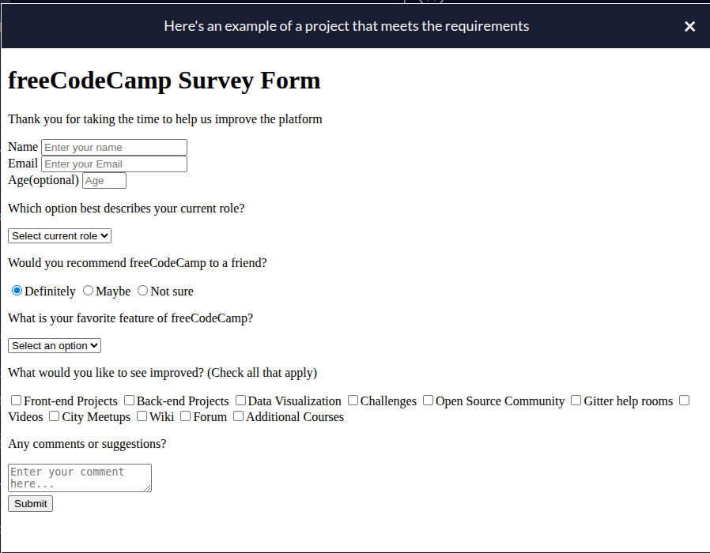

# freeCodeCamp HTML Certification Project

This is my submission for the HTML certification project on freecodecamp.org. HTML is the first course toward the Responsive Web Design Certification, which in itself is also a section of the Certified Full Stack Developer Curriculum. I have listed the link to the project prompt, example survey form, project instructions, and user stories that must be included in the project. **By design, will not save or submit user input.**

https://www.freecodecamp.org/learn/responsive-web-design-v9/lab-survey-form/build-a-survey-form

Instructions: Build an app functionally similar to this example project. Try not to copy the example project, give it your own personal style.

The project must fulfill the following user stories:

1. You should have an h1 element with an id of title.
2. Your #title should not be empty.
3. You should have a p element with an id of description.
4. Your #description should not be empty.
5. You should have a form element with an id of survey-form.
6. You should have an input element with an id of name.
7. Your #name should have a type of text.
8. Your #name should require input.
9. Your #name should be a descendant of #survey-form.
10. You should have an input element with an id of email.
11. Your #email should have a type of email.
12. Your #email should require input.
13. Your #email should be a descendant of #survey-form.
14. You should have an input element with an id of number.
15. Your #number should be a descendant of #survey-form.
16. Your #number should have a type of number.
17. Your #number should have a min attribute with a numeric value.
18. Your #number should have a max attribute with a numeric value.
19. You should have a label element with an id of name-label.
20. You should have a label element with an id of email-label.
21. You should have a label element with an id of number-label.
22. Your #name-label should contain text that describes the input.
23. Your #email-label should contain text that describes the input.
24. Your #number-label should contain text that describes the input.
25. Your #name-label should be a descendant of #survey-form.
26. Your #email-label should be a descendant of #survey-form.
27. Your #number-label should be a descendant of #survey-form.
28. Your #name should have a placeholder attribute and value.
29. Your #email should have a placeholder attribute and value.
30. Your #number should have a placeholder attribute and value.
31. You should have a select field with an id of dropdown.
32. Your #dropdown should have at least two selectable (not disabled) option elements.
33. Your #dropdown should be a descendant of #survey-form.
34. You should have at least two input elements with a type of radio (radio buttons).
35. You should have at least two radio buttons that are descendants of #survey-form.
36. All your radio buttons should have a value attribute and value.
37. All your radio buttons should have a name attribute and value.
38. Every radio button group should have at least 2 radio buttons.
39. You should have at least two input elements with a type of checkbox (checkboxes) that are descendants of #survey-form.
40. All your checkboxes inside #survey-form should have a value attribute and value.
41. You should have at least one textarea element that is a descendant of #survey-form.
42. You should have an input or button element with an id of submit.
43. Your #submit should have a type of submit.
44. Your #submit should be a descendant of #survey-form.

